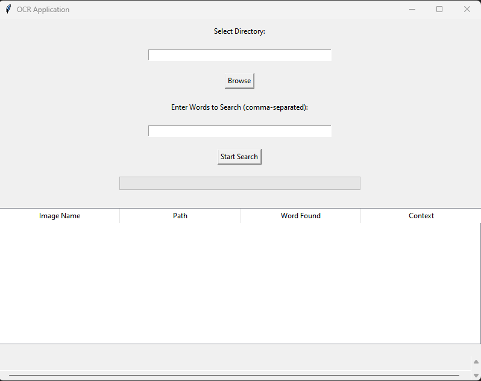

# OCR-Image-Search-App

OCR-Image-Search-App is a Python application that allows users to perform Optical Character Recognition (OCR) on images within a selected directory and search for specific words within the extracted text. The application displays the results in a graphical user interface (GUI) and provides options to open the images directly and export results to an Excel file.



## Features

- **Directory Selection**: Browse and select a directory containing images.
- **Text Extraction**: Use Tesseract to extract text from images.
- **Word Search**: Search for specific words within the extracted text.
- **Context Display**: Display the context (sentence) where the word is found.
- **Results Table**: Display search results in a table format.
- **Image Preview**: Open the image files directly from the results.
- **Export to Excel**: Export the search results to an Excel file.

## Installation

### Prerequisites

- Python 3.x
- Tesseract-OCR
- Required Python libraries: `pytesseract`, `Pillow`, `pandas`, `tkinter`, `openpyxl`

### Steps

1. **Clone the repository**:
   ```bash
   git clone https://github.com/your-username/OCR-Image-Search-App.git
   cd OCR-Image-Search-App

2. **Install Tesseract-OCR**:
    Windows: Download the installer from https://github.com/UB-Mannheim/tesseract/wiki and follow the installation instructions.

### Usage 
Run the application:
    - python ocr_app.py


